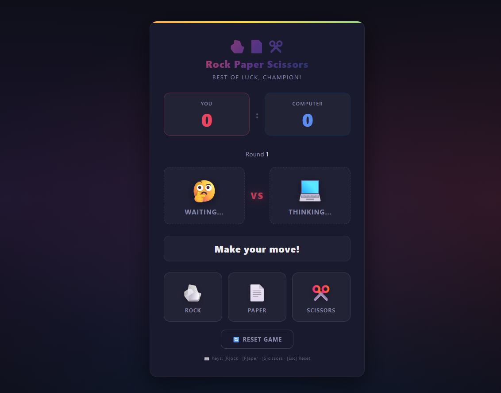

# 🪨📄✂️ Rock Paper Scissors

A modern, interactive **Rock Paper Scissors** game built with **HTML, CSS, and JavaScript**.

The project focuses on combining simple game logic with a polished user interface, smooth animations, responsive design, and interactive feedback.

---

## ✨ Features

* 🎮 Interactive Rock, Paper, Scissors gameplay
* 🧮 Real-time player vs. computer score
* 🔢 Round tracking
* 🤖 Randomized computer choices
* 🏆 Automatic win, lose, and draw detection
* ✨ Smooth UI animations and transitions
* 🎉 Confetti animation when the player wins
* 🔄 Reset game functionality
* ⌨️ Keyboard controls
* 📱 Responsive design for smaller screens
* 🌙 Modern dark-themed interface
* 🎨 Gradient, glow, hover, and visual feedback effects

---

## 🛠️ Technologies Used

* **HTML5** — Structure and semantic layout
* **CSS3** — Styling, responsive design, animations, gradients, and effects
* **JavaScript (ES6+)** — Game logic, state management, DOM manipulation, and event handling

---

## 🎮 How to Play

1. Open the game in your browser.
2. Choose one of:

   * 🪨 Rock
   * 📄 Paper
   * ✂️ Scissors
3. The computer randomly selects its choice.
4. The game determines the winner.
5. Your score and the computer's score are updated automatically.
6. Continue playing as many rounds as you want.

### ⌨️ Keyboard Shortcuts

| Key        | Action     |
| ---------- | ---------- |
| `R` or `1` | Rock       |
| `P` or `2` | Paper      |
| `S` or `3` | Scissors   |
| `Esc`      | Reset Game |

---

## 🧠 Game Logic

The game uses a simple relationship between the three choices:

```text
Rock     → beats Scissors
Paper    → beats Rock
Scissors → beats Paper
```

The JavaScript implementation stores these relationships in a `CHOICES` object and uses the selected choices to determine the result of each round.

The game also maintains its current state, including:

```text
Player Score
Computer Score
Current Round
Player Choice
Computer Choice
Game Status
Reset Status
```

---

## 🎨 UI & Design

The interface was designed with a modern dark aesthetic.

### Design elements include:

* Dark gradient background
* Glass-like translucent cards
* Rounded UI components
* Glowing borders and shadows
* Animated gradient header
* Interactive choice buttons
* Hover and active states
* Animated result banners
* Score highlighting
* Responsive layouts

The layout automatically adapts to smaller screen sizes using CSS media queries.

---

## ✨ Animations & Interactions

The project includes several custom CSS and JavaScript animations:

* Container entrance animation
* Animated gradient shimmer
* Choice reveal animation
* VS badge pulse animation
* Result banner animation
* Score-card highlight animation
* Button hover/active animations
* Victory confetti effect

These interactions make the game feel more like a small polished application rather than a basic JavaScript exercise.

---

## 📂 Project Structure

```text
Rock-Paper-Scissors/
│
├── index.html
├── main.css
├── main.js
├── assets/preview.png
└── README.md
```

The current implementation keeps the HTML, CSS, and JavaScript together in a single HTML file, making the project simple to run and easy to experiment with.

---

## 📱 Responsive Design

The game includes responsive breakpoints for smaller devices.

The interface adjusts:

* Container padding
* Heading sizes
* Scoreboard spacing
* Choice button sizes
* Icons
* Battle area spacing
* Result banner typography

This keeps the game usable across desktop, tablet, and mobile screens.

---

## 🧩 What I Learned

Building this project helped me practice several important frontend concepts:

* DOM manipulation
* Event listeners
* JavaScript objects
* Game-state management
* Conditional logic
* Random value generation
* Dynamic class manipulation
* CSS animations
* Responsive web design
* Keyboard event handling
* Creating reusable JavaScript functions
* Connecting UI interactions with application logic

Most importantly, it reinforced something I try to follow while learning:

> **Build projects, not just tutorials.**

Even a small game can teach you how different parts of frontend development work together.

---

## 🔮 Future Improvements

Some features I may add in future versions:

* 🏆 Best-of-5 / Best-of-10 game modes
* 💾 Persistent high scores using LocalStorage
* 🎵 Sound effects
* 🎚️ Difficulty levels
* 🤖 Smarter computer strategy
* 🌐 Online multiplayer
* 📊 Game statistics
* 🎨 Theme customization
* 🏅 Achievements and badges

---

## 📸 Project Preview

*Add your project screenshot or demo GIF here.*

```markdown

```

---

## 👨‍💻 Author

**Tanishq**

BCA Student | Web Developer | Programmer | Tech Enthusiast

I'm continuously learning, building projects, and exploring new areas of technology.

---

## ⭐ Support

If you found this project interesting, consider giving the repository a ⭐ on GitHub.

**Build → Break → Debug → Improve → Repeat. 🚀**

---

### 📄 License

This project is open-source and available for learning and personal use.
